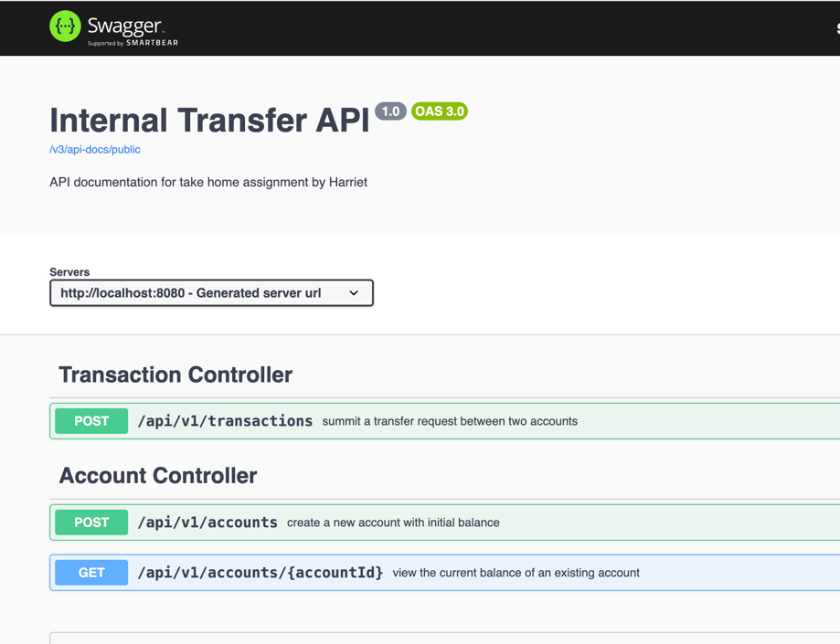

# paymenttransfer

### Data Models

### Below is the prerequisite installed software to run the project in local computer
1. Docker
2. Java 21 
3. IntelliJ (optional for viewing the code)
4. Maven
5. A Mac

### 💡 Assumptions
- The application may receive many transfer requests at the same time, for different account pairs, hence a non-blocking
api for submitting transaction is used
- Multiple threads may want to modify the balance of the same account at the same time. To prevent race condition, 
we need to lock the accountid to ensure only one thread can modify that account at one time
- The application can be deployed in multiple replicas, which necessitates the use of a distributed lock as opposed to an object lock within the jvm

### 💡 Design Consideration
- Message Queue is used for asychronous processing of transaction request, so as to handle high load of transfer requests
- Redis distributed lock is used to prevent concurrent writes on the db on the source and destination account
- @Transaction annotation by Spring is used to annotate methods where multiple db writes happen, to ensure that any partial 
database write is rolled back in case of exception.

### 🛠️ Setup Instructions

#### ✅ Step 1. Git Clone the Project to your local machine.
#### ✅ Step 2. Open your terminal, pull and execute images of postgres, activemq-artemis and redis through the following command

docker pull postgres:17

docker run --name harriet-postgres -e POSTGRES_USER=harriet -e POSTGRES_PASSWORD=harriet -e POSTGRES_DB=bank -p 5432:5432 postgres:17

docker pull apache/activemq-artemis:latest-alpine

docker run --detach --name harrietmq -p 61616:61616 -p 8161:8161 apache/activemq-artemis:latest-alpine

docker pull redis

docker run --name harriet-redis -d -p 6379:6379 redis

#### ✅ Step 3. Execute the following on your terminal
- cd <repo-folder-in-your-local>
- ./mvnw clean install
- ./mvnw spring-boot:run

#### ✅ Step 4. View the Api document via this swagger
http://localhost:8080/swagger-ui/index.html#/

