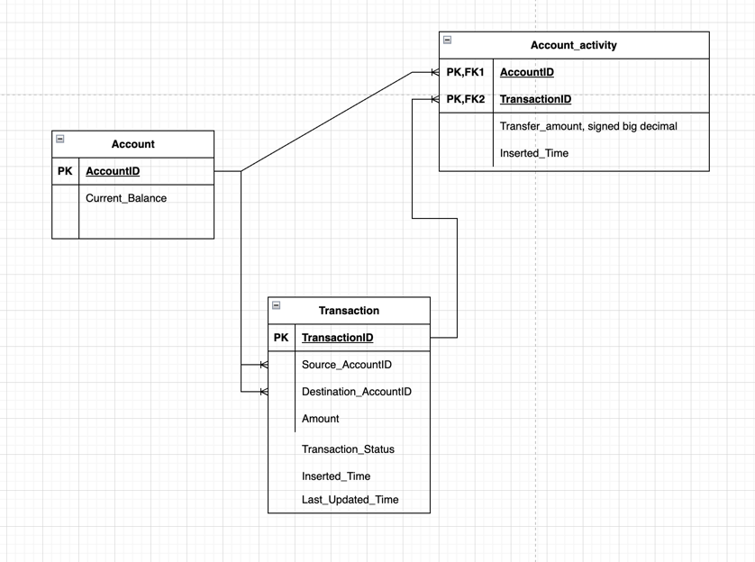

# paymenttransfer

### Data Models

### Below is the prerequisite installed software to run the project in local computer
1. Docker
2. Java 21 
3. IntelliJ
4. Maven

### 🛠️ Setup Instructions

#### ✅ Step 1. Git Clone the Project to your local machine.
#### ✅ Step 2. Pull and execute images of postgres, activemq-artemis and redis through the following command

docker pull postgres:17

docker run --name harriet-postgres -e POSTGRES_USER=harriet -e POSTGRES_PASSWORD=harriet -e POSTGRES_DB=bank -p 5432:5432 postgres:17

docker run --detach --name harrietmq -p 61616:61616 -p 8161:8161 --rm apache/activemq-artemis:latest-alpine

docker pull redis

docker run --name harriet-redis -d -p 6379:6379 redis

#### ✅ Step 3. Run the application through your intellJ

